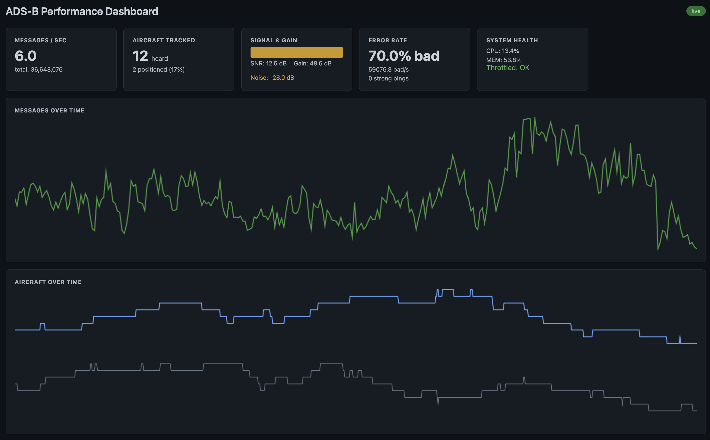

# ADS-B Performance Dashboard

[](https://www.gnu.org/licenses/old-licenses/gpl-2.0.html)

A lightweight, zero-dependency Go web dashboard for Raspberry Pi Zero that reads dump1090-fa's `stats.json` and displays real-time receiver performance metrics.



## Features

- **Real-time push** via Server-Sent Events (SSE) — no polling from the browser
- **Live dashboard** with dark theme, CSS grid, canvas sparklines
- **Minimal footprint** — single ~8MB binary, ~20MB RSS, no dependencies
- **Safe by design** — read-only stats access, idle CPU scheduling, no writes to disk

## Cards

| Card | Shows |
|------|-------|
| Messages/sec | Current rate + total lifetime messages |
| Aircraft Tracked | Now / peak today |
| Signal Quality | Strong signal ratio + SNR / Signal / Noise in dB |
| System | CPU load, memory usage |
| Health | Receiver uptime, data freshness |
| Messages Over Time | Sparkline (last 300 samples) |
| Aircraft Over Time | Sparkline (last 300 samples) |

## Quick Start

```bash
# Build for Pi Zero
GOOS=linux GOARCH=arm GOARM=6 go build -o adsb-dashboard .

# Deploy
scp adsb-dashboard pi@raspberrypi:~
ssh pi@raspberrypi
./adsb-dashboard --addr 0.0.0.0 --port 8081
```

Open `http://raspberrypi:8081` in a browser.

## Flags

| Flag | Default | Description |
|------|---------|-------------|
| `--addr` | `127.0.0.1` | Bind address |
| `--port` | `8081` | HTTP port |
| `--stats` | `/run/dump1090-fa/stats.json` | Path to stats.json |
| `--poll` | `60s` | Stats poll interval (min 10s) |

## systemd Service

```bash
sudo cp adsb-dashboard /usr/local/bin/
sudo cp adsb-dashboard.service /etc/systemd/system/
sudo systemctl enable --now adsb-dashboard
```

The service uses `CPUSchedulingPolicy=idle` and `IOSchedulingClass=idle` to yield to piaware/dump1090-fa. Override `--addr 0.0.0.0` via `systemctl edit adsb-dashboard` for LAN access:

```ini
[Service]
ExecStart=
ExecStart=/usr/local/bin/adsb-dashboard --addr 0.0.0.0
```

## Endpoints

| Path | Description |
|------|-------------|
| `GET /` | Dashboard HTML |
| `GET /events` | SSE stream (stats JSON every poll interval) |
| `GET /health` | Health check (server + data freshness) |

## Architecture

```
dump1090-fa → stats.json → Go server (poll 60s)
                                ↓
                         SSE /events
                                ↓
                       Browser dashboard
                       (vanilla JS + canvas)
```

All static assets are embedded in the binary via `//go:embed`. No web server, no framework, no npm — just Go.
