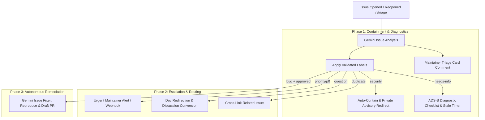

# Downstream Automation Implementation Plan

This document outlines a phased, step-by-step engineering plan to build downstream automations triggered by the automated Gemini issue triage workflow in [`adsb-dashboard`](../../..).

---

## 1. Current State & Foundation

The triage engine is now operational in [.github/workflows/issue-triage.yml](../../../.github/workflows/issue-triage.yml):
* **Execution:** Triggers on `issues: [opened, reopened]` and manual `/triage` comments.
* **Engine:** `google-github-actions/run-gemini-cli@v0.1.22` running in zero-tool sandbox mode (`core: []`).
* **Outputs:** 
  * **Categories:** `bug`, `enhancement`, `documentation`, `question`, `needs-info`, `invalid`, `spam`, `security`
  * **Priorities:** `priority/p0`, `priority/p1`, `priority/p2`
  * **Tags:** `help wanted`, `good first issue`, `duplicate`



---

## 2. Phased Implementation Roadmap

### Phase 1: Containment & Diagnostic Quality (Immediate Value)

#### Step 1.1: Security Vulnerability Auto-Containment (`security`)
* **Objective:** Prevent premature public disclosure of zero-day vulnerabilities or sensitive stack traces.
* **Trigger:** Label `security` applied by triage.
* **Actions:**
  1. Post a canned redirect comment pointing the author to [GitHub Security Advisories](https://github.com/zagers/adsb-dashboard/security/advisories/new) and [`SECURITY.md`](../../../SECURITY.md).
  2. Automatically close and lock the public issue with reason `resolved` / `private`.
* **Implementation Location:** Add a conditional step to the existing `label` job in [.github/workflows/issue-triage.yml](../../../.github/workflows/issue-triage.yml).

```javascript
// Step 1.1 Logic Snippet
if (selectedLabels.includes('security')) {
  await github.rest.issues.createComment({
    owner: context.repo.owner,
    repo: context.repo.repo,
    issue_number: issueNumber,
    body: "Thank you for the report. Security-sensitive issues are handled privately to protect users. Please submit details via our [Private Vulnerability Reporting Form](https://github.com/zagers/adsb-dashboard/security/advisories/new). This issue is being closed to prevent public disclosure."
  });
  await github.rest.issues.update({
    owner: context.repo.owner,
    repo: context.repo.repo,
    issue_number: issueNumber,
    state: 'closed',
    state_reason: 'not_planned'
  });
  await github.rest.issues.lock({
    owner: context.repo.owner,
    repo: context.repo.repo,
    issue_number: issueNumber,
    lock_reason: 'resolved'
  });
}
```

---

#### Step 1.2: ADS-B Diagnostic Checklist (`needs-info`)
* **Objective:** Automatically prompt users for hardware, OS, and service telemetry when bug reports lack actionable details.
* **Trigger:** Label `needs-info` applied by triage.
* **Actions:**
  1. Post a diagnostic checklist tailored to the Raspberry Pi / `dump1090-fa` stack:
     * Receiver SDR model (RTL-SDR v3/v4, FlightAware Pro Stick, etc.)
     * Host architecture & OS (`uname -a`, Pi Zero W vs Pi 3/4/5)
     * Service state (`systemctl status dump1090-fa`)
     * Freshness of `/run/dump1090-fa/aircraft.json`
  2. Setup auto-removal: When the issue author responds with a comment, automatically remove the `needs-info` label.
  3. Setup stale policy: If no activity occurs for 14 days with `needs-info`, close the issue automatically.

---

#### Step 1.3: Maintainer Triage Card Comment
* **Objective:** Give maintainers an instant 10-second summary table in the issue discussion.
* **Trigger:** During the `triage` workflow execution.
* **Actions:**
  * Adjust the Gemini prompt to output a structured JSON object containing both `labels` (array) and `summary` (markdown string).
  * The `label` job posts the markdown summary as a sticky maintainer comment:

```markdown
### 🤖 Automated Triage Report
| Metric | Assessment |
|---|---|
| **Category** | `bug` |
| **Priority** | `priority/p2` |
| **Suspected Component** | `adsb-dashboard/stats.go` (SSE ring buffer) |
| **Suggested Action** | Inspect 1Hz RAM stream vs 60s disk buffer handling |
```

---

### Phase 2: Escalation & Routing (Medium Complexity)

#### Step 2.1: Priority P0 Escalation (`priority/p0`)
* **Objective:** Immediately alert maintainers of catastrophic outages (e.g., dashboard panic, severe memory leak on Pi Zero, total telemetry freeze).
* **Trigger:** Label `priority/p0` applied.
* **Actions:**
  1. Auto-assign the repository owner via [`CODEOWNERS`](../../../.github/CODEOWNERS).
  2. Dispatch an alert via GitHub repository notification or external webhook (Discord/Slack/Telegram).

---

#### Step 2.2: Documentation & Question Routing (`question`)
* **Objective:** Deflect common setup questions from the issue tracker.
* **Trigger:** Label `question` applied.
* **Actions:**
  1. Post links to relevant sections in [`README.md`](../../../README.md) and [`docs/`](../../../docs).
  2. (Optional) Convert the issue into a GitHub Discussion if GitHub Discussions are enabled on the repository.

---

#### Step 2.3: Duplicate Detection & Linking (`duplicate`)
* **Objective:** Consolidate fragmented bug reports without manual search.
* **Trigger:** Gemini identifies similarity with an existing issue.
* **Actions:**
  * Have Gemini output the referenced issue number (e.g., `#12`).
  * Downstream script posts: *"This issue appears similar to #12. Please review that discussion."*

---

### Phase 3: Autonomous Remediation (Advanced AI)

#### Step 3.1: Automated Bug Reproduction & Fixer (`gemini-issue-fixer`)
* **Objective:** Automatically generate a draft pull request with a reproduction test and code fix for well-scoped bugs.
* **Trigger:** Maintainer comments `/fix` or issue labeled `bug` + `priority/p2`.
* **Actions:**
  1. Create an isolated workflow `.github/workflows/issue-fixer.yml`.
  2. Checkout the codebase and grant read/write access to a branch `fix/issue-<number>`.
  3. Gemini writes a reproduction test in [`adsb-dashboard/stats_test.go`](../../../adsb-dashboard/stats_test.go) or [`adsb-dashboard/server_test.go`](../../../adsb-dashboard/server_test.go).
  4. Runs `go test ./...` to verify test failure.
  5. Implements the fix in Go source code until tests pass.
  6. Opens a Draft Pull Request linked to the issue (`Fixes #<number>`).

---

## 3. Step-by-Step Execution Checklist

| Step | Feature | Effort | File(s) Affected | Impact |
|:---:|:---|:---:|:---|:---:|
| **1** | **Security Auto-Containment** | 15 min | `.github/workflows/issue-triage.yml` | 🔴 Critical Security |
| **2** | **`needs-info` ADS-B Checklist** | 20 min | `.github/workflows/issue-triage.yml` | 🟡 High Operational |
| **3** | **Maintainer Triage Card Comment** | 30 min | `.github/workflows/issue-triage.yml` | 🟢 Workflow Efficiency |
| **4** | **Author-Reply `needs-info` Remover** | 20 min | `.github/workflows/issue-triage.yml` | 🟢 User Experience |
| **5** | **Priority P0 Notification Webhook** | 25 min | `.github/workflows/issue-triage.yml` | 🟡 Incident Response |
| **6** | **Question Doc Links / Discussions** | 20 min | `.github/workflows/issue-triage.yml` | 🔵 Backlog Hygiene |
| **7** | **Autonomous Gemini Issue Fixer** | 2 hours | `.github/workflows/issue-fixer.yml` | 🟣 Full Automation |
